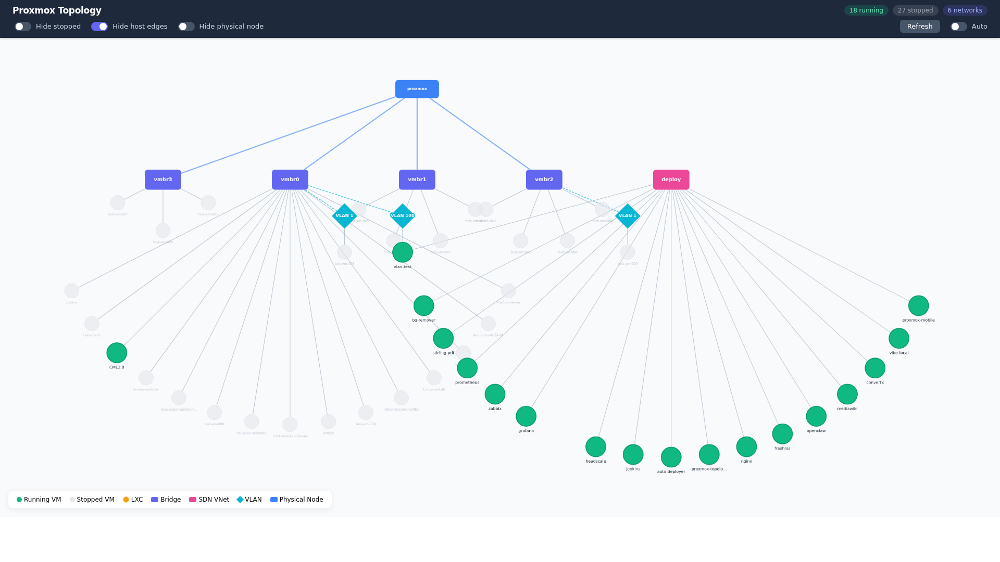

# Proxmox Network Topology Visualizer

A web-based dashboard that visualizes the network topology of a Proxmox VE cluster. It runs via Docker Compose and connects to a remote Proxmox VE server through the API to display physical nodes, VMs, networks, VLANs, and IP address ranges interactively.

\

## Architecture

```
┌──────────────────────┐          ┌─────────────────────┐
│  Local PC (Mac, etc.) │          │  Proxmox VE Server  │
│                      │          │                     │
│  ┌────────────────┐  │  HTTPS   │  ┌───────────────┐  │
│  │ Frontend       │  │          │  │ Proxmox API   │  │
│  │ (Nginx:80)     │  │          │  │ (Port 8006)   │  │
│  └───────┬────────┘  │          │  └───────────────┘  │
│          │ /api/*    │          │                     │
│  ┌───────▼────────┐  │          │                     │
│  │ Backend        │──┼──────────┤                     │
│  │ (Flask:5000)   │  │ API Token│                     │
│  └────────────────┘  │          │                     │
│                      │          │                     │
│  (Docker Compose)    │          │                     │
└──────────────────────┘          └─────────────────────┘
```

- **Frontend (Nginx)** serves the Web UI on port 80 and proxies `/api/*` requests to the backend
- **Backend (Flask)** connects to the Proxmox VE API using token authentication to retrieve topology data
- The backend runs only within the Docker network and does not expose ports to the host

## Features

- **Real-time topology visualization** of the entire Proxmox cluster
- **Interactive graph** — click nodes and edges to view detailed information with neighbor highlighting
- **Display filters** — toggle visibility of stopped VMs, host edges, and physical nodes
- **Custom layout** — bridges and SDN VNets arranged horizontally with VMs in semicircles below
- **Auto-refresh** at configurable intervals (10s, 30s, 1m, 5m)
- **Detail panel** — click any node/edge to see properties (VMID, IP, CPU, memory, VLAN, etc.)
- **Supported resources:**
  - Physical nodes (Proxmox servers)
  - Virtual machines (QEMU)
  - Containers (LXC)
  - Network bridges
  - VLANs
  - IP address information
  - SDN VNETs

## Prerequisites

- Proxmox VE 7.0+
- Docker & Docker Compose
- Proxmox API token
- Network access to the Proxmox server on port 8006

## Quick Start

### 1. Create a Proxmox API Token

In the Proxmox Web UI:

1. Go to **Datacenter → Permissions → API Tokens**
2. Click **Add**
3. Enter the user and token ID
4. Uncheck **Privilege Separation** (if needed)
5. Save the generated token secret

Or via CLI:
```bash
pveum user token add user@pam tokenname --privsep=0
```

### 2. Clone and Configure

```bash
git clone https://github.com/nnnnnnnnnke/proxmox-network-topology-visualizer.git
cd proxmox-network-topology-visualizer

cp .env.example .env
```

Edit `.env` with your Proxmox server details:
```bash
PROXMOX_HOST=https://192.168.1.100:8006
PROXMOX_TOKEN_ID=root@pam\!topology
PROXMOX_TOKEN_SECRET=xxxxxxxx-xxxx-xxxx-xxxx-xxxxxxxxxxxx
VERIFY_SSL=false
```

### 3. Start

```bash
docker compose up -d
```

### 4. Access

Open your browser:
```
http://localhost
```

## Display Filters

The header bar provides toggles to control what is shown on the graph:

| Filter | Default | Description |
|---|---|---|
| **Hide stopped** | ON | Hide VMs/containers that are not running |
| **Hide host edges** | ON | Hide dotted lines connecting physical nodes to their VMs |
| **Hide physical node** | ON | Hide the physical Proxmox server node |

These filters are applied server-side via query parameters on the `/api/topology` endpoint.

## API Endpoints

Accessible via Nginx at `http://localhost/api/*`:

| Endpoint | Description |
|---|---|
| `GET /api/health` | Health check |
| `GET /api/topology?hide_stopped=true&hide_hosts_edges=true&hide_physical_node=true` | Full topology data (with filters) |
| `GET /api/nodes` | List of nodes |
| `GET /api/nodes/<node>/network` | Node network configuration |
| `GET /api/nodes/<node>/vms` | VMs and containers on a node |
| `GET /api/config` | Current configuration |

## Graph Legend

| Color | Shape | Resource Type |
|---|---|---|
| 🟢 Green | Circle | Running VM (QEMU) |
| ⚪ Gray | Circle | Stopped VM |
| 🟠 Orange | Hexagon | LXC container |
| 🟣 Indigo | Rounded rectangle | Network bridge |
| 🩷 Pink | Rounded rectangle | SDN VNET |
| 🔵 Blue | Rounded rectangle | Physical node |

## Troubleshooting

### Cannot connect to Proxmox API

```bash
curl -sk https://<PROXMOX_HOST>:8006/api2/json/version \
  -H "Authorization: PVEAPIToken=<TOKEN_ID>=<TOKEN_SECRET>"
```

### View container logs

```bash
docker compose logs backend
docker compose logs frontend
```

### SSL certificate errors

Set `VERIFY_SSL=false` in `.env` when using a self-signed certificate.

## Development

```bash
# Backend
cd backend
python -m venv venv
source venv/bin/activate
pip install -r requirements.txt
python app.py

# Frontend (separate terminal)
cd frontend
npm install
npm start
```

## License

[MIT License](LICENSE)

---

# Proxmox Network Topology Visualizer (日本語)

Proxmoxクラスタのネットワークトポロジを可視化するWebベースのダッシュボードです。
Docker Composeで起動し、リモートのProxmox VEサーバーにAPI経由で接続して、物理ノード、仮想マシン、ネットワーク、VLAN、IPアドレス帯を視覚的に表示します。

\

## 機能

- **リアルタイムトポロジ表示**: Proxmoxクラスタ全体のネットワーク構成を視覚化
- **インタラクティブなグラフ**: ノードやエッジをクリックして詳細情報を表示（隣接ノードのハイライト付き）
- **表示フィルタ**: 停止中のVM、ホストエッジ、物理ノードの表示/非表示を切替可能
- **カスタムレイアウト**: ブリッジ・SDN VNetを水平配置し、VMを扇状に配置
- **自動更新**: 10秒〜5分の間隔で自動更新
- **詳細パネル**: ノードクリックでVMID、IP、CPU、メモリ、VLANなどの詳細を表示

## セットアップ

### 1. Proxmox APIトークンの作成

```bash
pveum user token add user@pam tokenname --privsep=0
```

### 2. クローンと環境設定

```bash
git clone https://github.com/nnnnnnnnnke/proxmox-network-topology-visualizer.git
cd proxmox-network-topology-visualizer

cp .env.example .env
# .env を編集してProxmoxサーバーの情報を設定
```

### 3. 起動

```bash
docker compose up -d
```

ブラウザで `http://localhost` にアクセス。

## 表示フィルタ

ヘッダーバーのトグルで表示内容を制御できます：

| フィルタ | デフォルト | 説明 |
|---|---|---|
| **Hide stopped** | ON | 停止中のVM/コンテナを非表示 |
| **Hide host edges** | ON | 物理ノードとVMを結ぶ点線を非表示 |
| **Hide physical node** | ON | 物理Proxmoxサーバーノードを非表示 |

## ライセンス

[MIT License](LICENSE)
